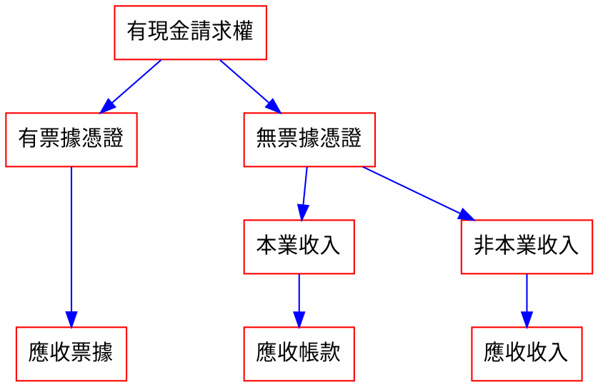
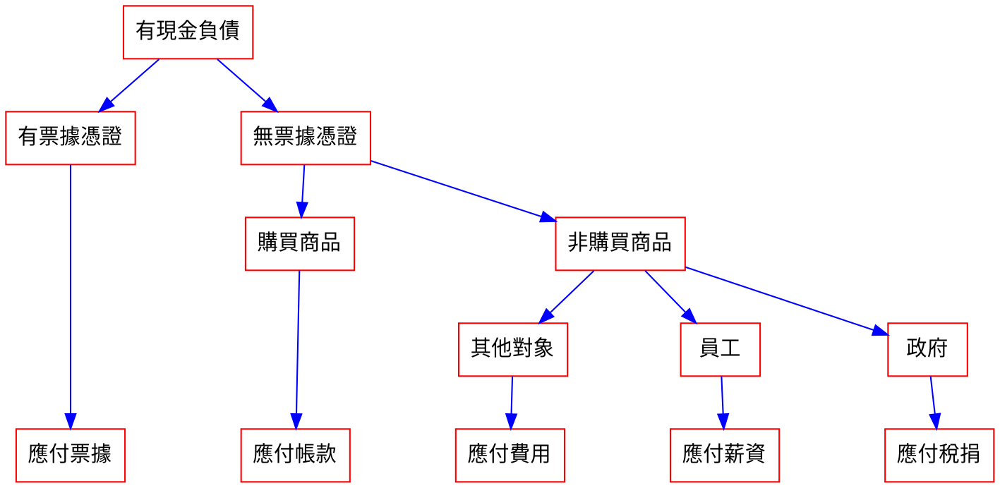
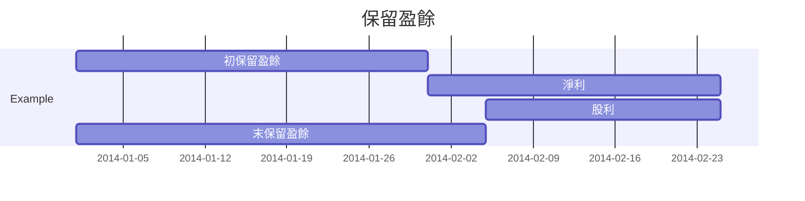
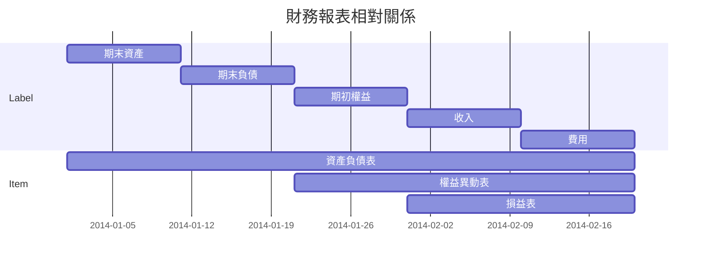

> 會計學筆記

# 會計要素

    會計 = 企業的成績單 = 財務報表
 
- 財務報表(成績單)項目

## 資產 (Assets)

> [color=#D63B29] 需要時可輕易變賣為現金

- 具 **交換價值** 之財物或權利
    1. 現金
    2. 短期投資
        - 持有 **低於一年**
    3. 應收票據
        - 本票、支票
        - 書面憑證
        - 有現金請求權 $\to$ **時間已定**、**有票據憑證**
    4. 應收帳款
        - 顧客、債務人所欠本企業之款項
        - 透過出售商品、提供服務產生
        - 主要營業項目產生 $\to$ 本業收入
        - 有現金請求權 $\to$ **時間未定**、**無票據憑證**、**營業活動產生**
    5. 應收收入
        - 應收利息、租金
        - **非主要營業項目產生**
        - 有現金請求權

> [color=#D63B29] 應收 $\to$ **有現金請求權** 且 **目前未收**



> [color=#D63B29] 生產工具

- 具 **使用價值** 之財物或權利
    1. 用品盤存
        - **尚未使用** 但擁有
        - **尚未使用**
        - **單價較低** 之 **消耗材**
        - 使用年限 **低於一年**
    2. 預付費用
    3. 房屋及建築物
        - **建物**
    4. 土地
    5. 辦公設備
        - **生財器具**
        - **使用中**
        - **單價較高** 之 **耐久材**
        - 使用年限 **超過一年**
    6. 累計折舊

## 負債 (Liability)

- 借款
    1. 短期借款
        - 舉債清償期限 **低於一年**
    2. 長期借款
        - 舉債清償期限 **高於一年**
        - 常使用 **不動產** 抵押
        - 也稱 **抵押借款**
- 應付票據
    - **有票據形式**
- 應付帳款
    - 購買商品、原物料產生
    - 因 **賒購商品** 對供應商產商的負債
    - **無票據形式**
- 應付費用
    - **無票據形式**
    - 對其他對象的負債
- 應付薪資
    - 對員工的負債
    - **無票據形式**
- 應付稅捐
    - 對政府的負債
    - **無票據形式**
- 預收收入
    - 向客戶收取現金時並未提供商品或勞務
    - **無票據形式**

> [color=#D63B29] 應付 $\to$ **有現金負債** 且 **目前未付**




## 權益 (Equity)

> 股東權益 [color=#D63B29] $\to$ 股東對資產的 **請求權**

### 股本

$\to$ 股東因 **投入資本** 對資產的請求權

    當初投資資本

### 保留盈餘

$\to$ 股東因 **公司獲利** 對資產的請求權

    公司盈餘(累加)
    
    末保留盈餘 = 初保留盈餘 + 本期淨利 - 本期股利
    


### 股利

$\to$ 分配給股東

## 收益 (Revenue)

    收入 + 利益

### 收入

> [color=#D63B29] 出售商品或提供勞務所賺得之貨價或代價

- [本業產生](#補充：本業產生-正業收入)
    - 服務收入

- 非本業產生
    - 租金收入
    - 利息收入
    
    
### 利益

> [color=#D63B29] 非因出售商品或提供勞務所致之經濟效益增加

## 費損 (Expense)

    費用 + 損失

### 費用

> [color=#D63B29] 為了 **產生收入** 而 **消耗的資源** $\to$ 一定會 **有效益產生**
 
1. 薪資費用
2. 廣告
3. 水電
4. 保險
5. 用品費用
6. 郵電費
7. 租金費用
8. 利息費用
9. 折舊費用
10. 呆帳費用

### 損失

> [color=#D63B29] 非因出售商品或提供勞務所致之經濟效益減少


:::info 
### 補充：統合

- 收入 - 費用
    $>0$ $\to$ 淨利
    $<0$ $\to$ 淨損
:::


# 會計恆等式

## 產權

> [color=#D63B29] 對資產之權利

    資產         = 產權
            　　 = 負債 + 權益
    資金用途    　  資金來源

- 產權來源
    - 債權人 $\to$ **債權**，負債
    - 投資人 $\to$ **權益**，淨值

## 權益

    權益         = 資產 - 負債

- 投資人 (股東)
    - 企業賺錢 $\to$ 得利
    - 企業賠錢 $\to$ **須負責任**

> [color=#D63B29] 公司結束營業、將資產清算變現後，先清償債權人；若有剩餘再歸還股東。

- 債權人
    - 企業賺錢 $\to$ 無差別
    - 企業賠錢 $\to$ 可拿回資本，**不需負責**

> [color=#D63B29] 股東 = 業主，對公司權利及義務同進退

:::info
### 補充：情境模擬

1. 成立之初
2. 結束營業
    1. 立即結束營業
    2. 多年後結束營業
:::

> [color=#D63B29] 會計恆等式必永成立

## 權益分配恆等式

    末權益 = 末股本 + 末保留盈餘
          = 末股本 + 初保留盈餘 + 本期淨利 - 本期股利
    初權益 = 初股本 + 初保留盈餘 
    
---

    末權利 - 初權益 = 本期增資 + 本期淨利 - 本期股利
    末權利         = 本期增資 + 初權益 　+ [本期淨利] - 本期股利
                  = 本期增資 + 初權益 　+ [本期收入  - 本期費用] - 本期股利

---
    
    R     = L     +  E     + R      - X  
    末資產 = 末負債 + [初權益 + 本期收入 - 本期費用]
          = 末負債 + [末權益]


:::info

### 補充：本業產生 (正業收入)

1. 服務收入 $\to$ 服務業

2. 銷貨收入 $\to$ 零售業

:::

# 會計科目與交易分析

## 會計科目

$\to$ 財務報表項目

> 詳見 [會計要素](#會計要素)

## 交易分析

### 交易要素

1. 主體
    - 股東
    - 債權人
    - 顧客
2. 客體
    - 權利 $\to$ 物權、債權
    - 義務 $\to$ 債務
3. 交易行為 $\to$ 使 **資產、負債、權益發生變動** 且 **金額可以衡量**
    - 交換
    - 清償
    - 贈與 

### 交易步驟

### 分析交易

        A     = L     + E     + R     - X
        資產    負債     權益     收入     費用

- 第一類型：資產增加、權益增加
    - ex: 公司成立初入股

``` 
    A     = L     + E     + R     - X
    現金+           股本+
```

- 第二類型：資產增加、負債增加
    - ex: 借款

```
    A     = L     + E     + R     - X
    現金+    短期借款+
```

- 第三類型：某項資產增加、某項減少
    - ex: 購買生產工具

```
    A     = L     + E     + R     - X
    現金-
    設備+
```


- 第四類型：資產增加、收入增加
    - ex: 售出服務、產品

```
    A     = L     + E     + R     - X
    現金+                    服務收入+
```


> [color=#D63B29] 承認收入的時間點 $\to$ 服務已完成 $or$ 商品已交付


- 第五類型：資產減少、費用增加
    - ex: 繳郵電費

```
    A     = L     + E     + R     - X
    現金-                            郵電費+
```

- 第六類型：資產增加、負債增加
    - ex: 還款

```
    A     = L     + E     + R     - X
    現金-    短期借款-
```

> [color=#D63B29] 當前會計週期之所有交易類型加總 $\to$ 期末餘額

# 財務報表與一般公認會計原則

        末      末     　末
        A     = L     + E
                末      初
              = L     + E     + R     - X
              
## 財務報表

1. 損益表
    - 某段期間經營 **損益** 之狀況
3. 權益異動表
    - 表達期初至期末 **權益** 變動之狀況
    - 股東為出資人 $\to$ 特別說明 **權益** 變動
4. 資產負債表
    - 表達期末 **資產**、**負債**、**權益** 變動之狀況
6. 現金流量表

:::info
### 分類

1、2 $\to$ 期間報表
3、4 $\to$ 時點報表

1 = 2 $\neq$ 3
:::



## 綜合損益表

        收入    - 費用    = 淨利

## 資產負債表

        資產    = 負債    + 權益